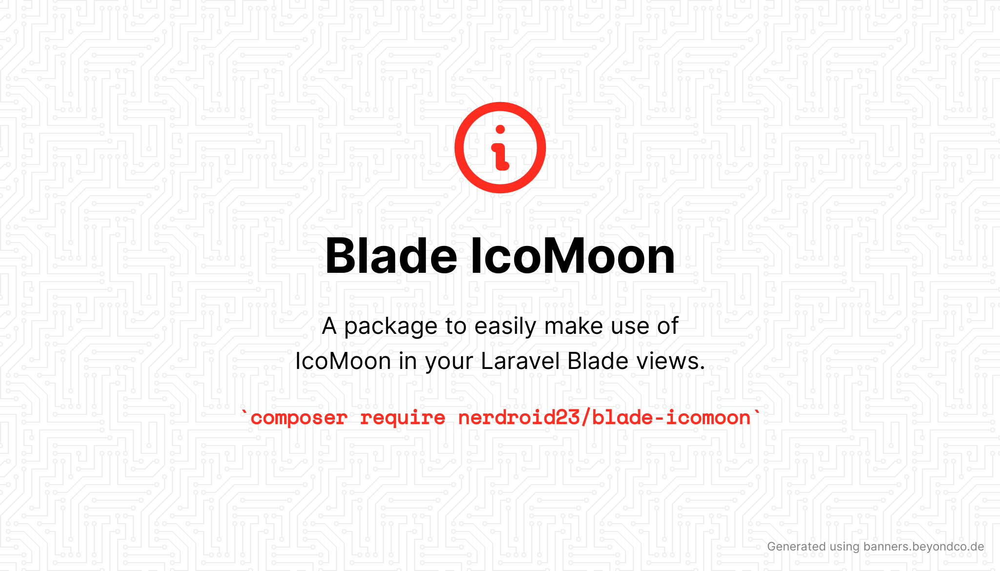

# Blade IcoMoon

[](https://packagist.org/packages/nerdroid23/blade-icomoon)
[](https://github.com/nerdroid23/blade-icomoon/actions?query=workflow%3Arun-tests+branch%3Amain)
[](https://github.com/nerdroid23/blade-icomoon/actions?query=workflow%3A"Check+%26+fix+styling"+branch%3Amain)
[](https://packagist.org/packages/nerdroid23/blade-icomoon)

A package to easily make use of [IcoMoon](https://icomoon.io) in your Laravel Blade views.

For a full list of available icons see [the SVG directory](./resources/svg).

## Requirements

- PHP 7.4 or higher
- Laravel 8.0 or higher

## Install

You can install the package via composer:

```bash
composer require nerdroid23/blade-icomoon
```

## Configuration

Blade IcoMoon also offers the ability to use features from Blade Icons like default classes, default attributes, etc. If you'd like to configure these, publish the `blade-icomoon.php` config file:

You can publish the config file with:

```bash
php artisan vendor:publish --provider="Nerdroid23\BladeIcomoon\BladeIcomoonServiceProvider" --tag="blade-icomoon-config"
```

This is the contents of the published config file:

```php
return [

    /*
    |-----------------------------------------------------------------
    | Default Prefix
    |-----------------------------------------------------------------
    |
    | This config option allows you to define a default prefix for
    | your icons. The dash separator will be applied automatically
    | to every icon name. It's required and needs to be unique.
    |
    */

    'prefix' => 'icomoon',

    /*
    |-----------------------------------------------------------------
    | Fallback Icon
    |-----------------------------------------------------------------
    |
    | This config option allows you to define a fallback
    | icon when an icon in this set cannot be found.
    |
    */

    'fallback' => '',

    /*
    |-----------------------------------------------------------------
    | Default Set Classes
    |-----------------------------------------------------------------
    |
    | This config option allows you to define some classes which
    | will be applied by default to all icons within this set.
    |
    */

    'class' => '',

    /*
    |-----------------------------------------------------------------
    | Default Set Attributes
    |-----------------------------------------------------------------
    |
    | This config option allows you to define some attributes which
    | will be applied by default to all icons within this set.
    |
    */

    'attributes' => [
        // 'fill'   => 'currentColor',
        // 'width'  => 32,
        // 'height' => 32,
    ],

];
```

## Usage
Icons can be used a self-closing Blade components which will be compiled to SVG icons:

```blade
<x-icomoon-500px />
```

You can also pass classes to your icon components:

```blade
<x-icomoon-500px class="w-6 h-6 text-red-500" />
```

And even use inline styles:

```blade
<x-icomoon-500px style="color: red" />
```

### Raw SVG Icons

If you want to use the raw SVG icons as assets, you can publish them using:

```shell
php artisan vendor:publish --tag=blade-icomoon-icons --force
```

Then use them in your views like:

```blade

```

### Blade Icons

Blade IcoMoon uses Blade Icons under the hood. Please refer to [the Blade Icons readme](https://github.com/blade-ui-kit/blade-icons) for additional functionality.

## Testing

```bash
composer test
```

## Changelog

Please see [CHANGELOG](CHANGELOG.md) for more information on what has changed recently.

## Contributing

Please see [CONTRIBUTING](.github/CONTRIBUTING.md) for details.

## Security Vulnerabilities

Please review [our security policy](.github/SECURITY.md) on how to report security vulnerabilities.

## Credits

- [Joe Sylnice](https://github.com/nerdroid23)
- [All Contributors](../../contributors)

## License

The MIT License (MIT). Please see [License File](LICENSE.md) for more information.
